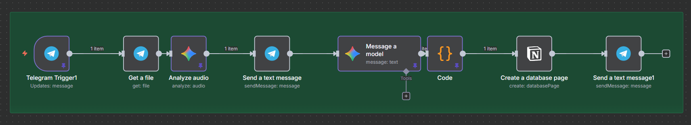
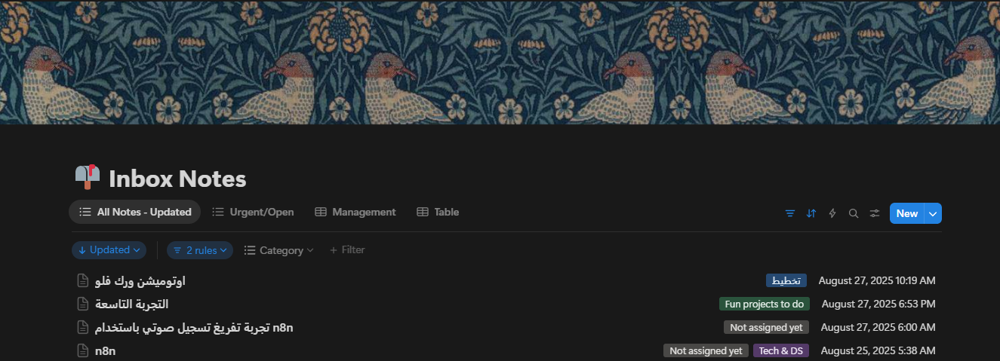
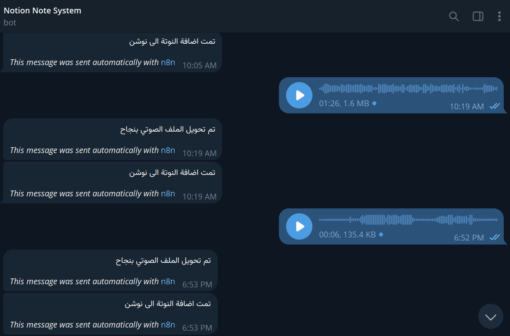

# AI-Powered Voice Note Assistant with n8n, Telegram, and Notion

This repository contains an n8n workflow that transforms a Telegram bot into a personal voice note assistant. It automatically transcribes, summarizes, and organizes voice notes into a structured Notion database, effectively creating a "Second Brain" for your thoughts.

 

## 🚀 Project Motivation

The project was created to solve a common productivity problem: voice notes are excellent for capturing fleeting ideas, but they quickly become a disorganized "black hole" of information that is impossible to search or act upon.

The goal was to build a seamless system to convert these unstructured audio thoughts into a structured, searchable, and actionable "Second Brain" inside Notion.

## 🛠️ Tech Stack & Core Components

-   **Automation Engine:** [**n8n**](https://n8n.io/) (self-hosted)
-   **User Interface:** [**Telegram**](https://telegram.org/) (via a custom bot)
-   **AI Processing:** [**Google Gemini API**](https://ai.google.dev/) (used for two distinct tasks)
-   **Data Storage:** [**Notion API**](https://www.notion.so/)

## 🌊 Workflow Design & Logic

The workflow is designed as an intelligent, event-driven pipeline that executes the following steps:

1.  **Trigger (Telegram):** The `Telegram Trigger` node listens for new messages and activates specifically when a **voice note** is received.

2.  **Download Audio:** A `Telegram` node uses the `file_id` from the trigger to download the audio file, making it available for processing.

3.  **AI Step 1: Transcription:** The binary audio data is sent to a `Google Gemini` node. This first AI call has a very specific and strict prompt: transcribe *only* the spoken content into raw text, ensuring maximum speech-to-text accuracy.

4.  **Initial Confirmation:** A `Telegram` node immediately sends a confirmation message to the user (e.g., "The audio file was transcribed successfully") to provide feedback.

5.  **AI Step 2: Structuring & Categorization:** The raw transcript from the previous step is sent to a *second* `Google Gemini` node. This node uses a more sophisticated prompt with three objectives:
    -   Suggest a suitable **title** for the note.
    -   Assign a **category** from a predefined list.
    -   Return the original text, title, and category in a clean **JSON format**.

6.  **Parse JSON:** A `Code` node receives the JSON string from the AI and uses `JSON.parse()` to convert it into a structured n8n data object, making the `title`, `category`, and `text` available as separate fields.

7.  **Store in Notion:** The `Notion` node connects to a specific database ("Inbox Notes"). It creates a new page, mapping the structured data from the previous step to the appropriate database properties (Title, Category, and the page content).

8.  **Final Confirmation:** A final `Telegram` node sends a message confirming that the note has been successfully saved to Notion, providing closure to the process.

   
  &nbsp; &nbsp; &nbsp; &nbsp; 

## ✨ The Core AI Strategy: A Two-Step Pipeline

Instead of a single, complex AI call, this workflow uses a **two-step AI pipeline**. This is a deliberate design choice for several reasons:

-   **Separation of Concerns:** It separates the purely technical task of **transcription** from the more creative/logical task of **structuring and categorization**.
-   **Increased Accuracy:** By giving each AI node a single, highly-focused task, we get a more accurate result for each step. The transcription is cleaner, and the structuring is more reliable.
-   **Modularity:** This design makes the workflow easier to debug and enhance.

## 🔮 Next-Level Enhancements (Potential Future Work)

The current workflow is a robust foundation. The following features could be added to elevate it to a truly intelligent agent:

1.  **Dynamic Notion Routing:**
    -   **Concept:** Enhance the AI's role to act as a "router." The user could specify the destination within the voice note itself (e.g., "Add this to my 'Project Ideas' database" or "Save this under the 'Meeting Notes' page").
    -   **Implementation:** The second Gemini prompt would be updated to extract a `destination` entity. An n8n `IF` or `Switch` node would then use this entity to dynamically select the correct Notion Database ID before the final `Create Page` step.

2.  **AI-Powered Content Formatting:**
    -   **Concept:** Instead of just saving a block of text, the AI could be instructed to format the note for better readability.
    -   **Implementation:** The second Gemini prompt would be modified to identify logical sections in the transcript and structure them using Notion's block formats (e.g., headings, bullet points, numbered lists, checklists for action items). The `Code` node would then parse this structured format and the `Notion` node would use it to build a rich, visually organized page.
